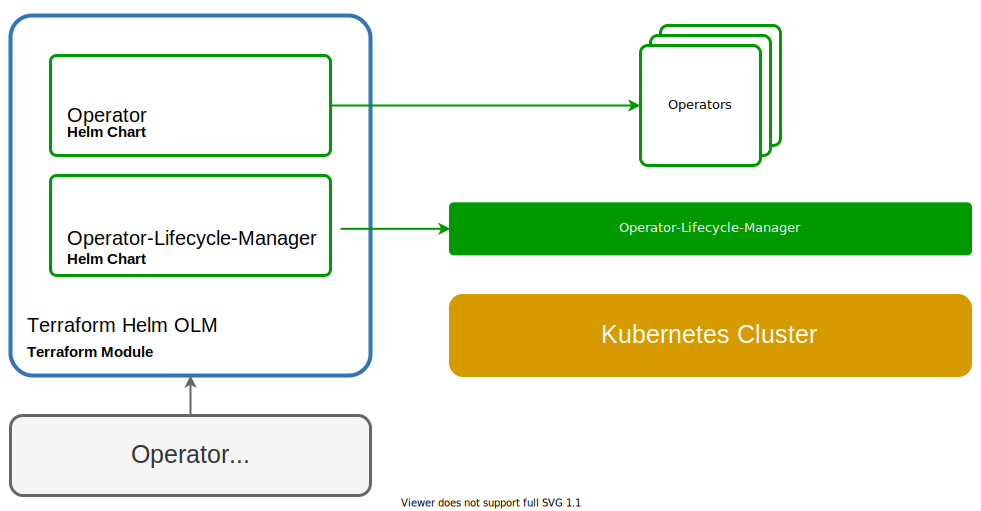

# terraform-helm-olm

Deploys Operator Lifecycle Manager via a helm chart to a 1.14.0+ Kubernetes cluster.

## Overview


## Example Operator Configuration
```hcl
namespaces = {
    management = "olm"
    operator   = "operators"
}

# TODO: Implement this part
operator_subscriptions = [
    {
        name = "my-argocd-operator"
        operator = "argocd-operator"
        channel = alpha
        source = operatorhubio-catalog
    },
    {
        name = "my-cert-manager-operator"
        operator = "cert-manager"
        channel = stable
        source = operatorhubio-catalog
    }
]
```